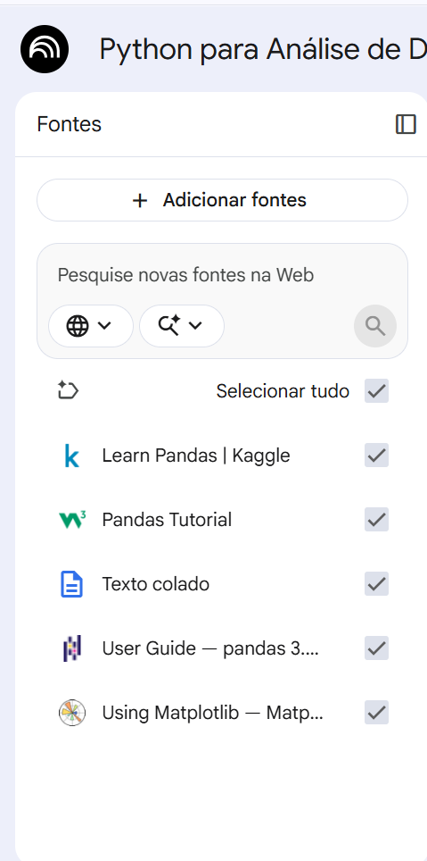

# Miniguia de Estudos - Pandas para Análise de Dados com NotebookLM

## 📖 Contexto

Este projeto foi desenvolvido como parte do desafio da DIO utilizando o NotebookLM como ferramenta de aprendizagem ativa.

O tema escolhido foi **Python para Análise de Dados com Pandas**, uma das bibliotecas mais utilizadas para manipulação, limpeza e análise de dados.

---

# 🎯 Objetivos

- Compreender os conceitos fundamentais da análise de dados.
- Estudar os principais recursos da biblioteca Pandas.
- Aprender técnicas de limpeza e tratamento de dados.
- Conhecer boas práticas na utilização de DataFrames.
- Explorar o uso da Inteligência Artificial como apoio ao aprendizado.

---

# 📚 Curadoria de Fontes

As seguintes fontes foram utilizadas no NotebookLM:

1. Learn Pandas | Kaggle
2. Pandas Tutorial | W3Schools
3. Documentação Oficial do Pandas
4. Pandas User Guide
5. Documentação Oficial do Matplotlib

---

# 🖼️ Evidências do NotebookLM

## Fontes Utilizadas



## Recursos do Pandas


## Erros Comuns em DataFrames


## Prompt Genérico


## Prompt Refinado


---

# 🧠 Engenharia de Prompts

## Prompt 1

### Pergunta

> Quais são os principais recursos da biblioteca Pandas para manipulação de dados?

### Resultado

- Leitura de dados CSV, JSON, Excel e SQL
- Limpeza de dados
- Filtragem e indexação
- Agrupamento e agregação
- Estatísticas descritivas

---

## Prompt 2

### Pergunta

> Quais erros iniciantes costumam cometer ao trabalhar com DataFrames?

### Resultado

- Não tratar valores ausentes
- Problemas com indexação
- Tipos de dados incorretos
- Chained Assignment
- Alterações acidentais nos dados

---

# ⚠️ Cicatriz Encontrada

Durante os testes foi possível perceber que prompts muito genéricos produziam respostas superficiais.

### Prompt Inicial

> Explique Pandas.

### Problema

A resposta apresentou conceitos corretos, porém sem foco em estudantes iniciantes.

### Solução

Refinei o prompt especificando o público-alvo e solicitando exemplos práticos.

### Prompt Refinado

> Explique Pandas para um estudante iniciante de Análise e Desenvolvimento de Sistemas, utilizando exemplos simples em Python.

### Resultado

A resposta ficou mais clara, prática e contextualizada, demonstrando a importância da Engenharia de Prompts.

---

# 📖 Miniguia de Estudos

## O que é Pandas?

Pandas é uma biblioteca Python voltada para manipulação e análise de dados.

Ela oferece estruturas eficientes para organizar, limpar, transformar e analisar informações.

---

## Principais Estruturas

### Series

Estrutura unidimensional utilizada para armazenar dados.

```python
import pandas as pd

idades = pd.Series([20, 21, 22])
print(idades)
```

### DataFrame

Estrutura bidimensional semelhante a uma planilha.

```python
import pandas as pd

dados = {
    "Nome": ["Ana", "Carlos"],
    "Idade": [20, 25]
}

df = pd.DataFrame(dados)
print(df)
```

---

## Limpeza de Dados

Principais técnicas:

- Remoção de valores nulos
- Tratamento de duplicidades
- Conversão de tipos de dados
- Padronização de informações

Exemplo:

```python
df.dropna()
```

---

## Visualização de Dados

O Matplotlib pode ser utilizado junto ao Pandas para gerar gráficos.

```python
df["Idade"].plot(kind="bar")
```

---

# 📘 Glossário

| Conceito | Descrição |
|-----------|------------|
| Pandas | Biblioteca para análise de dados |
| Series | Estrutura unidimensional |
| DataFrame | Estrutura tabular |
| CSV | Arquivo de dados separado por vírgulas |
| Data Cleaning | Processo de limpeza dos dados |
| Indexação | Seleção de linhas e colunas |
| Matplotlib | Biblioteca para visualização de dados |

---

# 🔄 Prompts Reutilizáveis

### Aprendizado

> Explique [tema] para um estudante iniciante utilizando exemplos práticos.

### Comparação

> Compare [conceito A] e [conceito B], destacando vantagens e desvantagens.

### Exercícios

> Crie exercícios práticos sobre [tema] com respostas comentadas.

### Revisão

> Gere um resumo dos principais conceitos sobre [tema].

---

# ✅ Conclusão

O NotebookLM demonstrou ser uma ferramenta eficiente para organização do conhecimento e apoio aos estudos.

Através da análise das fontes selecionadas e da engenharia de prompts, foi possível aprofundar o conhecimento sobre a biblioteca Pandas e compreender a importância de formular perguntas bem estruturadas para obter respostas mais relevantes da Inteligência Artificial.

---

## 👨‍💻 Autor

**Murilo Santana**

Estudante de Análise e Desenvolvimento de Sistemas | Entusiasta de Dados e Tecnologia
